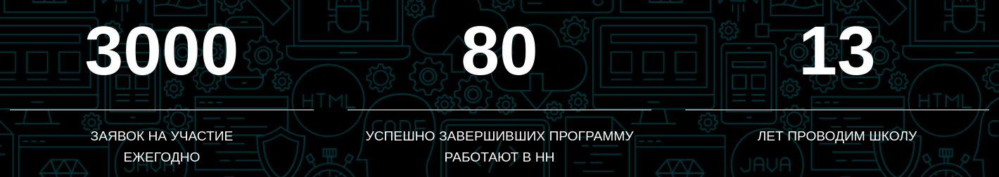
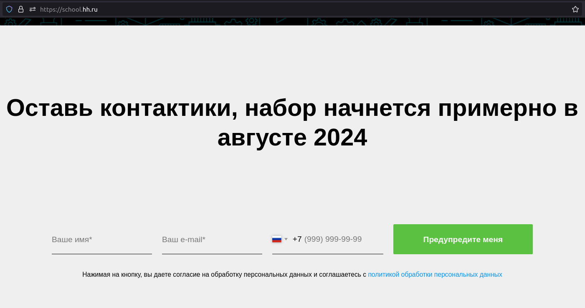

# Отзыв о Школе Программистов HeadHunter (hh.ru). Думать нельзя верить.

В 2022-2023 году я проходил обучение в [Школе Программистов](https://school.hh.ru/) компании HeadHunter. В данной статье я бы хотел поделиться своими впечатлениями от обучения в Школе.

## Содержание отзыва

- [Для кого и зачем](#для-кого-и-зачем)
- [Что стоит знать о компании HeadHunter](#что-стоит-знать-о-компании-headhunter)
    - [Организатор распространения информации в сети Интернет](#организатор-распространения-информации-в-сети-интернет)
    - [Как HeadHunter собирает и обрабатывает ваши персональные данные](#как-headhunter-собирает-и-обрабатывает-ваши-персональные-данные)
- [Что стоит знать о Школе Программистов](#что-стоит-знать-о-школе-программистов)
    - [Охэхэнная «Школа программистов»](#охэхэнная-«школа-программистов»)
    - [Школа Программистов на дому](#школа-программистов-на-дому)
    - [Публичные трансляции финальных демо проектов](#публичные-трансляции-финальных-демо-проектов)
    - [Школа программистов как решение проблемы найма / Лев Екасов (HeadHunter)](#школа-программистов-как-решение-проблемы-найма--лев-екасов-headhunter)
- [Статистика набора и найма. Думать или верить?](#статистика-набора-и-найма-думать-или-верить)
- [Как я поступил в Школу Программистов](#как-я-поступил-в-школу-программистов)
    - [Вступительные испытания](#вступительные-испытания)
    - [Онлайн-собеседование](#онлайн-собеседование)
- [Теоретическая часть](#теоретическая-часть)
- [Проектная часть](#проектная-часть)
    - [Как всё было организовано](#как-всё-было-организовано)
    - [Как прошел проект](#как-прошел-проект)
    - [Что было дальше](#что-было-дальше)
- [Благодарность организаторам](#благодарность-организаторам)
- [HeadHunter — корпоративная этика, ценности и принципы](#headhunter--корпоративная-этика-ценности-и-принципы)
- [Школа Программистов 2024](#школа-программистов-2024)
- [Post scriptum](#post-scriptum)
- [Post post scriptum](#post-post-scriptum)

## Для кого и зачем

Целевая аудитория данной статьи — в первую очередь те, кто планирует поступить в Школу.

Цель статьи — рассказать о процессе обучения в Школе, чтобы кандидаты имели больше информации о том, как именно проходит обучение. Эта информация, надеюсь, поможет кандидатам принять взвешенное решение о том, стоит ли им поступать в Школу Программистов. Для тех, кто решит поступать и успешно пройдет вступительные испытания, эта информация, возможно, сделает процесс обучения прозрачным и комфортным.

## Что стоит знать о компании HeadHunter

### Организатор распространения информации в сети Интернет

В первую очередь стоит прочитать [статью](https://ru.wikipedia.org/wiki/HeadHunter) о компании HeadHunter в Википедии. В том числе стоит обратить внимание на то, что в 2022 году Роскомнадзор [внес](https://www.kommersant.ru/doc/5708647) компанию в реестр организаторов распространения информации в сети Интернет, обязывающий собирать, хранить и предоставлять информацию о пользователях по требованию ФСБ по [закону Яровой](https://ru.wikipedia.org/wiki/%D0%97%D0%B0%D0%BA%D0%BE%D0%BD_%D0%AF%D1%80%D0%BE%D0%B2%D0%BE%D0%B9). Ниже приведено описание содержания этого закона:

> Среди нововведений содержатся повышение срока по ряду уголовных статей, введение дополнительных причин для запрета на выезд и въезд, повышение срока хранения операторами мобильной связи информации о фактах приёма, передачи и содержимого голосовой информации и сообщений (от полугода до трёх лет), дозволение следователям получать информацию из электронной переписки, лишение гражданства (убрали из закона) для совершивших террористические и экстремистские действия, введение понятия «акт международного терроризма» и введение уголовной ответственности за недоносительство. 

### Как HeadHunter собирает и обрабатывает ваши персональные данные

Следующий важный момент — [политика обрабоки персональных данных](https://school.hh.ru/personal_data) компании HeadHunter. Стоит обратить внимание, что, согласно данной политике, компания HeadHunter различными способами осуществляет сбор информации через интернет-сайты и мобильные приложения (пункт 2, Сбор персональных данных). Один из таких способов — «пассивный сбор персональных данных о текущем подключении в части статистических сведений». К таким сведениям относятся в том числе:

- идентификатор пользователя, присваиваемый Сайтом;
- страна пользователя;
- регион пользователя;
- часовой пояс, установленный на устройстве пользователя;
- провайдер пользователя;
- браузер пользователя;
- перечень поддерживаемых языков на устройстве пользователя;
- архитектура процессора устройства пользователя;
- ОС пользователя;
- параметры экрана (разрешение, глубина цветности, параметры размещения страницы на экране);
- информация об использовании средств автоматизации при доступе на Сайт.

## Что стоит знать о Школе Программистов

### Охэхэнная «Школа программистов»

Следующее, что, возможно, могло бы быть интересно кандидатам — информация о том, «как работает Школа Программистов, о том, что это за Школа, как работает набор, кого мы готовим и что получаем в финале». Информацию об этом можно узнать из следующего видео: [Охэхэнная «Школа программистов»](https://www.youtube.com/watch?v=FXwh6LGYXpE). Обратите внимание на следующие моменты:

- **Кирилл Васильев** (8.41). Наша цель — к концу учебного цикла подготовить выпускников, которые могли бы у нас работать как разработчики.
- **Александр Дворник** (10.25). А теперь я расскажу о самом интересном. О том, как происходит отбор в команды HeadHunter. За школьниками мы аккуратно наблюдаем уже с самых первых лекций. Смотрим на их посещение и на то, как ребята выполняют домашние задания. Начиная с проектной части у каждой группы школьников есть ментор, и именно он внимательно следит за тем, что ребята делают на проекте, кто какой вклад вносит. Это именно те пункты, на которые стоит обратить внимание, если вы хотите попасть в команды HeadHunter.
- **Макс Сыромятников** (0.27). За 12 лет из выпускников мы наняли 87 разработчиков.

### Школа Программистов на дому

[Школа Программистов на дому (13 октября, 2021)](https://www.youtube.com/watch?v=vxBLek6wrYw&t) — ещё одно видео, из которого можно узнать о том, как работает Школа. Обратите внимание на следующие моменты:

- **Алексей Анацкий** (1.17). Первая часть обучения — это лекции. По некоторым лекциям у нас бывают домашние задания, и мы внимательно следим за тем, чтобы вы его выполняли.
- **Павел Мартышев** (2.10). На мой взгляд самая интересная и полезная часть Школы Программистов — это создание проектов. Несмотря на то, что это учебные проекты, они иногда всё-таки попадают в продакшен, и выпускники сразу могут видеть результаты своей работы.
- **Олеся Плотникова** (0.17). Вот уже 11 лет мы бесплатно превращаем талантливых людей в профессиональных разработчиков. Первая Школа Программистов стартовала в далеком 2010 году.
- **Павел Мартышев** (3.00). В прошлом году, например, вышло 14 человек. За всё время существования Школы 77 выпускников перешло работать в нашу компанию.

### Публичные трансляции финальных демо проектов

В 2021 и в 2022 году компания HeadHunter проводила публичные трансляции финальных демо проектов Школы Программистов. Возможно кандидатам будет интересно посмотреть эти демо, они доступны на YouTube:

- [Финальное демо проектов школы программистов и продактов 2022](https://www.youtube.com/watch?v=-uJgUugVqS4)
- [Финальное онлайн-демо школы программистов и школы продактов](https://www.youtube.com/watch?v=lZASUtpFcWo)

В 2021 и 2022 году демо проектов проводил сотрудник компании HeadHunter Алексей Анацкий. В 2023 году публичного демо не проводилось.

### Школа программистов как решение проблемы найма / Лев Екасов (HeadHunter)

В [данном](https://www.youtube.com/watch?v=-S3_1VCb_1A) видео [бывший](https://www.youtube.com/watch?v=QqYnnUy1zjk) сотрудник компании HeadHunter Лев Екасов рассказывает о том, как организована Школа Программистов.

Обратите внимание на часть доклада, которая начинается с 19.54. Начиная с этого момента Лев Екасов рассказывает о том, что компания HeadHunter организует Школу Программистов в том числе для того, чтобы развивать текущих сотрудников HeadHunter. Как именно могут развиваться сотрудники?

- **Лев Екасов** (21.21). Читать лекции.
- **Лев Екасов** (22.25). Руководить школьным проектом. ... разработчик может не уметь руководить командой или проектом и Школа может ему в этом помочь. Когда я полтора года после Школы проработал разработчиком, в компании открылась позиция тимлида, так как старый тимлид уехал за границу. Образовался внутренний конкурс. ... я пошел куратором одного из проектов внутри Школы, получил опыт управления командой, затем успешно прошел собеседование и стал тимлидом.
- **Лев Екасов** (24.02). Узнавать про новые технологии слушая чужие лекции. ... это реально важно использовать Школу по максимуму. Школа не является только инструментом для найма и, возможно, даже не столько инструментом для найма.

Также обратите внимание на следующий момент:

- **Вопрос из аудитории** (36.20). Вы делаете Школу именно для того, чтобы растить себе кадры, или чтобы делать мир лучше?
- **Лев Екасов** (37.29). Я бы ответил так: это двоякий вопрос конечно. ... найм — это важная часть, возможно это основополагающая вещь. ... большая часть моих коллег, которые участвуют в работе над Школой, делают это для того, чтобы делать мир лучше, чтобы работать с крутыми ребятами, ... чтобы позволять реализовывать людям свои желания и мечты.

## Статистика набора и найма. Думать или верить?

Пользуясь данными из различных источников, я собрал статистику набора в Школу Программистов и найма в HeadHunter. Вот что получилось:

| Года | Число заявок | Решили 2 задачи | Собеседование | Поступили | Наняты | Нанято всего
|-|-|-|-|-|-|-|
|2017 - 2018|-|-|-|-|-|40|
|2020 - 2021|3773|283|-|42|14|77|
|2021 - 2022|3400|190|-|50|-|**87**|
|2022 - 2023|2873|270|122|42|-|**80**|
|2023 - 2024|2483|590|122|43|-|-|

Где можно найти все цифры:

- Данные о том, сколько выпускников было нанято за 8 лет существования Школы, можно найти в [видео (9.40)](https://www.youtube.com/watch?v=-S3_1VCb_1A) из секции [Школа программистов как решение проблемы найма / Лев Екасов (HeadHunter)](#школа-программистов-как-решение-проблемы-найма--лев-екасов-headhunter).
- Данные за 2020 год, то есть за 11 лет существования Школы, можно найти в [видео](https://www.youtube.com/watch?v=vxBLek6wrYw&t) из секции [Школа Программистов на дому](#школа-программистов-на-дому).
- Данные о том, сколько всего человек было нанято в HeadHunter за 12 лет существования Школы, можно найти в [видео](https://www.youtube.com/watch?v=FXwh6LGYXpE) из секции [Охэхэнная «Школа программистов»](#охэхэнная-«школа-программистов»).
- Данные за 2022 год (кроме количества нанятых выпускников) можно найти в следующией статье: [Школа Программистов-2022: вступительные испытания и разбор задач](https://habr.com/ru/companies/hh/articles/725648/).
- Данные за 2023 год (кроме количества нанятых выпускников) можно найти в следующей статье: [Разбор задач Школы программистов 2023](https://habr.com/ru/companies/hh/articles/769642/).

Данные о том, сколько выпускников было нанято за 13 лет существования Школы, можно найти на [сайте](https://school.hh.ru/) Школы. На момент написания статьи (конец 2023 года), цифры такие:

Если думать, то можно заметить, что в этих данных есть противоречие: число выпускников, нанятых за 13 лет существования Школы (80 человек), меньше, чем число выпускников, нанятых за 12 лет существования Школы (87 человек).

Отмечу здесь же, что во время [проектной части Школы](#проектная-часть) ментор нашего проекта Роман Филлипских упоминал, как я помню, о том, что «в прошлом году взяли много народу, около половины всех школьников». Я не знаю, стоит ли этому верить. Я не знаю, сколько выпускников взяли в HeadHunter в 2023 году. Но факт остается фактом: в статистике, которая касается количества нанятых выпускников, и которую компания HeadHunter публикует в открытых источниках, есть явное противоречие (но чтобы это противоречие заметить, нужно думать).

Возникают естественные вопросы:
- сколько на самом деле выпускников Школы стали сотрудниками HeadHunter?
- стоит ли верить той статистике, которую компания HeadHunter публикует в открытых источниках?

## Как я поступил в Школу Программистов

До апреля 2022 года я работал в IT компании в России. Затем я на некоторое время уехал из России и продолжал работать в той же компании. В августе 2022 года я уволился и вернулся в Россию. Примерно в октябре 2022 года я стал искать работу на сайте hh.ru. В футере сайта я нашел информацию о Школе Программистов и подал заявку на участие.

### Вступительные испытания

Через некоторое время мне пришла ссылка на вступительные испытания — 2 задачи на программирование, которые я успешно решил. Через несколько дней мне пришло письмо от HR компании HeadHunter Александра Дворника с приглашением поучаствовать в онлайн-собеседовании.

### Онлайн-собеседование

На онлайн-собеседовании присутствовало два человека от HeadHunter. Один из них — Евгений Анфалов. Другой — Кирилл, тимлид одной из команд HeadHunter (фамилию, к сожалению, не помню). На собеседовании мне предложили решить 3 задачи. Одна простая задача на программирование, вторая — на знание алгоритмов, третья — задача на проработку архитектуры веб-сервиса. Собеседование длилось 2 часа. Один час отводится на решение задач, один час — на обсуждение решений.

Через две недели после собеседования мне пришло письмо от HR компании HeadHunter Александра Дворника. В письме было сказано, что я успешно прошел вступительные испытания, и меня пригласили принять участие в Школе.

## Теоретическая часть

Общение участников Школы и организаторов проходило в Mattermost. Лекции проводились два раза в неделю, по некоторым лекциям были домашние задания. Все лекции записывались и выкладывались в чате в Mattermost. По каждой лекции участников Школы просили дать обратную связь. Для этого участников просили заполнять небольшой опрос после каждой лекции. Все опросы были анонимные.

Далее расскажу о преподавателях и лекциях, которые запомнились больше всего.

### Никита Бездольный (Git и GitHub)

Никита провел две лекции. Одна из них была про систему контроля версий git. Вторая — про GitHub. Качественные и интересные лекции. Несмотря на то, что c git и GitHub я раньше работал, немалая часть материалов была для меня новой.

_Nota bene_. Помню, что Никита в начале первой лекции рассказывал о том, как организована разработка в HeadHunter. В том числе Никита упомянул, что у каждого сотрудника HeadHunter есть своя версия сайта hh.ru для тестирования новой функциональности.

### Никита Башаров (Maven)

Никита вел лекцию про систему сборки Maven. Для меня это был полностью новый материал, так как до этого я работал только с Gradle.

### Олег Негрозов (Java)

Олег провел две лекции по Java. Первая лекция была про основы Java: система типов, условные конструкции, циклы, методы, классы. Вторая лекция — про более сложные темы: дженерики, интерфейсы, Stream API. Вообще я уже писал что-то на Java до поступления в Школу, так что все эти темы я скорее освежил в памяти.

Также было интересное домашнее задание, где нужно было реализовать пару методов и оценить сложность их работы в терминах O-нотации.

### Леонид Феськов (HTML/CSS)

Леонид читал лекцию по основам верстки. Вообще я обучался на направлении, посвященному бэкенд разработке, но мне также было интересно на базовом уровне познакомиться с технологиями, которые используют в своей работе фронтенд разработчики. И лекция Леонида мне в этом помогла.

### Борис Сержан (Тестирование)

Борис читал лекцию по тестированию. Лекция была скорее более теоретическая. Борис рассказал о том, какие бывают методы тестирования, зачем нужно проводить тестирование, как писать различные типы тестов, а также о том, как организовано тестирование в HeadHunter. Полезная и интересная лекция, узнал много нового для себя.

### Базы данных SQL

На этой лекции нам рассказали про основы SQL, а также о том, что такое реляционные базы данных, про PostgreSQL.

_Nota bene_. Здесь, как мне показалось, не хватило практических заданий. Хотя в описании одной из вакансий на hh.ru было указано, что в компании HeadHunter требуется знание SQL, в частности умение работать с оконными функциями. Но описание этой  вакансии я увидел случайно уже после проектной части.

### Александр Искусков (Базы данных NoSQL)

Александр провел лекцию по NoSQL базам данным. Рассказал, зачем они нужны, в чем разница между реляционными базами данных, а также рассказал, какие нереляционные базы данных используются в HeadHunter.

### Николай Вознесенский (Параллельные и асинхронные вычисления в Java)

Николай провел две лекции. Первая была посвящена различным базовым инструментам, которые позволяют выполнять параллельные вычисления в Java: потоки (Threads), thread-пулы, потокобезопасные структуры данных (ConcurrentHashMap, BlockingQueue).

Вторая лекция была про то, как выполнять параллельные вычисления с помощью Stream API. Также Николай рассказал про CompletableFuture — API, который позволяет выполнять асинхронные вычисления в Java и про виртуальные потоки (Virtual Threads).

После второй лекции Николай предложил участникам Школы выполнить необязательное домашнее задание. Тема интересная, поэтому домашнее задание я сделал. Николай проверил это задание, провел ревью, и в своем последнем комментарии написал, что «я бы наверное также писал». А также поздравил меня с тем, что я раньше всех выполнил это задание.

_Nota bene_. Было приятно услышать такие слова от разработчика с 15-летним опытом, который руководит командой WebServices, занимающейся разработкой основных сервисов HeadHunter.

Несмотря на то, что я раньше посещал лекции, посвященные параллельным и распределенным вычислениям, немалая часть материалов для меня оказалось новой. Домашнее задание также было интересным и, пожалуй, самым сложным, хотя до этого я уже реализовывал различные параллельные структуры данных. Например писал lock-free очередь с приоритетом.

### Безопасность веб-приложений (SQL Injections, XSS attacks)

Одна из самых интересных лекций. Но эту лекцию нам показывали в записи, так как, насколько я помню, автор данной лекции уволился из HeadHunter и переехал работать за границу.

### Артем Филиппов (JDBC, Hibernate)

Артем рассказал про API из Java, которые позволяют работать с SQL базами данных, а также про фреймворк Hibernate. Также после этой лекции Артем предложил выполнить домашнее задание, чтобы участники Школы могли потренироваться в использовании Hibernate.

### Наталья Лукьянчикова (A/B тесты)

С A/B тестами я до поступления в Школу знаком не был. Наталья на простом и доступном языке объяснила, что это за тесты и зачем они нужны. Также рассказала о том, каким образом такие тесты проводятся в компании HeadHunter.

### Николай Грибанов (Архитектура веб-приложений)

Николай рассказал про различные архитектурные паттерны, которые применяются при проектировании приложений с микросервисной архитектурой. Весь материал для меня был новый, так как ранее разработкой веб-приложений я не занимался.

### Евгений Бокшицкий (Брокеры сообщений, Kafka, RabbitMQ)

Евгений провел две лекции. Первая была посвящена рассказу о том, что такое брокеры сообщений и для чего они нужны. Вторая лекция была про конкретные технологии — Kafka и RabbitMQ.

Помню, что в начале первой лекции Евгений спросил всех участников Школы о том, кто и где работает, а также попросил всех участников написать эту информацию в общий чат. А также добавил, что нет ничего неприличного в том, чтобы работать разработчиком.

Один из школьников также спросил Евгения о том, чем он занимается в HeadHunter. Помню, что Евгений ответил, что ему стыдно признаться в том, чем он занимается.

### Алексей Дубинин (JVM)

Алексей рассказал о том, как работает Java Virtual Machine, а также про её различные реализации. До этой лекции я только на базовом уровне был знаком с тем, как работает JVM, поэтому также узнал для себя много нового.

### Кирилл Васильев (Jetty/Jersey)

Кирилл рассказал про контейнеры сервлетов, в частности про Jetty, а также про фреймворк Jersey. Хорошие и качественные лекции. Ранее разработкой бэкенда для веб-приложений я не занимался, поэтому весь материал был для меня новым.

### Роман Варламов (Docker)

Роман рассказал про различные технологии виртуализации и контейнеризации, в том числе про Docker. Отличная лекция. До этого я уже был знаком с такими технологиями, но только на базовом уровне, поэтому большая часть материалов оказалась для меня новой.

### Андрей Никишин (Spring)

Андрей рассказал про фрейворк Spring. После лекции Андрей предложил учатникам Школы выполнить домашнее задание, цель которого заключалась в том, чтобы взять готовый UI, который позволяет управлять списком дел, и реализовать для него бэкенд с использованием фреймворка Spring. 

Это также было одно из самых интересных и непростых заданий. После выполнения Андрей провел детальное и качественное ревью.

### Алексей Анацкий (Python)

Алексей провел лекцию по Python. Ранее я уже программировал на этом языке, поэтому большая часть материалов оказалась для меня знакомой, но что-то новое я для себя также узнал. В целом лекция была полезная и интересная. Единственное, чего не хватило — домашнего задания, чтобы попрактиковаться в использовании языка.

_Nota bene_. Отзыв уже получается довольно объемным. Поэтому перед тем, как читать далее, стоит немного отдохнуть и осознать прочитанное. Для этого можно немного отвлечься и взгянуть на картину британского художника Джона Уильяма Уотерхауса [«Одиссей и сирены»](https://ru.wikipedia.org/wiki/%D0%9E%D0%B4%D0%B8%D1%81%D1%81%D0%B5%D0%B9_%D0%B8_%D1%81%D0%B8%D1%80%D0%B5%D0%BD%D1%8B_(%D0%BA%D0%B0%D1%80%D1%82%D0%B8%D0%BD%D0%B0_%D0%A3%D0%BE%D1%82%D0%B5%D1%80%D1%85%D0%B0%D1%83%D1%81%D0%B0)#%D0%A1%D1%8E%D0%B6%D0%B5%D1%82_%D0%B8_%D0%BE%D0%BF%D0%B8%D1%81%D0%B0%D0%BD%D0%B8%D0%B5).

## Проектная часть

### Как всё было организовано

Через некоторе время после окончания лекционной части всех участников Школы пригласили на презентацию проектов. После презентации участников попросили выбрать три проекта, в которых они хотели бы участвовать. Затем всех участников поделили на команды.

Всего было семь проектов. В каждом из проектов участвовало три бэкенд разработчика, и один-два фронденд разработчика. У каждого проекта был один или несколько менторов.

Наш проект был посвящен разработке веб-сервиса, позволяющего проверять знания фронденд разработчиков — умение верстать и умение программировать на JavaScript. Автором проекта выступал Алексей Анацкий, ментором был Роман Филлипских — фронтенд разработчик из команды WebServices. Также нам помогал Александр Красовский — бэкенд разрабочик из команды WebServices.

Все проекты хранились в [репозитории](https://github.com/hhru-school) на GitHub, некоторые из проектов (в том числе и наш) были публичные.

### Как прошел проект

Все началось с того, что ментор нашего проекта Роман Филлипских добавил нас в приватный чат в Mattermost. Там мы договорились об онлайн-встрече всей командой.

На первой встрече мы познакомились, обсудили некоторые детали проекта, а также договорились о том, как будем выстраивать дальнейшую коммуникацию. Один из участников проекта предложил всю коммуникацию вести в Telegram. Большая часть участников и Роман согласились, и через некоторое время мы создали чат в Telegram.

Через некоторое время Роман добавил в чат в Mattermost ещё одного разработчика из HeadHunter — Александра Красовского. В чат в Telegram Александр не добавился, так как, по словам Романа, Александру было неудобно общаться в Telegram.

В итоге получилась следующая ситуация: все участники (включая меня) и ментор проекта Роман Филлипских общались в чате в Telegram. Александр Красовский присутствовал только в чате в Mattermost. При этом Александр участвовал в ревью Pull Request-ов бекэнд разрабочиков и, так как он был вне контекста всех обсуждений, которые велись в чате в Telegram, во время процесса ревью возникали проблемы со взаимопониманием.

Через некоторое время мы провели ещё две онлайн-встречи, на которых обсуждали зоны ответственности участников, обязанности, а также идеи, связанные с реализацией проекта. Я также предлагал свои идеи, в том числе схему базы данных, архитектуру бэкенда и другое. Также у меня были идеи по поводу того, как можно было бы проверять решения участников на плагиат.

Отмечу, что в блоге компании HeadHunter каждый год публикуются разборы задач, и в таких разборах упоминается, что в HeadHunter есть своя собственная система проверки решений на плагиат для уже существующией системы проверки задач:

- [разбор задач за 2023](https://habr.com/ru/companies/hh/articles/769642/)
- [разбор задач за 2020](https://habr.com/ru/companies/hh/articles/524666/)

Как написано в этих статьях, с помощью такой системы организаторы каждый год находят списанные решения. Мне было интересно узнать, как работает эта система, но, к сожалению, ни Алексей Анацкий (автор проекта), ни Никита Бездольный (автор статей) на проект не пришли.

В какой-то момент я почуствовал, что коммуникация в команде идет тяжело. Из-за того, что Александр Красовский (бэкенд разработчик команды WebServices) в чате в Telegram не присутствовал и ни на одну из онлайн-встреч не пришел, мне было сложно обсуждать свои идеи, связанные с реализацией бэкенда нашего сервиса. Я сам решил покинуть проект и сам вышел из чата в Telegram.

### Что было дальше

Примерно через две недели после того, как я сам вышел из чата в Telegram, я решил зайти в Mattermost. К моему удивлению у меня всё ещё был туда доступ, хотя других участников Школы, которые уходили с проектов, из Mattermost удаляли. Периодически я заходил в Mattermost и наблюдал за тем, что происходит в чате Школы. В том числе смотрел 1-е и 2-е промежуточные демо проектов.

Примерно через два с половиной месяца после начала проектной части мне на почту пришла ссылка на диплом об успешном окончании Школы, а также приглашение на финальное демо. На демо я пришел. Отмечу, что в 2023 году не было публичной трансляции финального демо на YouTube, хотя в 2022 и 2021 году такие трансляции [организовывались](#публичные-трансляции-финальных-демо-проектов). В 2023 году финальное демо проводил HR компании HeadHunter Александр Дворник, хотя в 2021 и 2022 году демо проводил Алексей Анацкий. Но, насколько я помню, в 2023 году Алексей на демо не пришел.

Я не знал, как мне интерпретировать то, что, во-первых, меня не удалили из чата в Mattermost, во-вторых, прислали диплом об успешном окончании Школы, а также пригласили на финальное демо. Поэтому после этого я решил написать на почту HR компании HeadHunter Александру Дворнику и организаторам Никите Бездольному и Алексею Анацкому с просьбой объяснить, что это значит, а также по возможности дать обратную связь по обучению в Школе. Также я спросил, могу ли поучаствовать в собеседовании в компанию HeadHunter.

В ответ я не получил никакой обратной связи, и на собеседование меня не пригласили. Александ Дворник ответил, что высылал мне автоматическое письмо с отказом, и что, возможно, это письмо попало в спам. А также отметил, что в HeadHunter никогда не берут Junior разработчиков с рыка.

Я также уточнил у Александра, могу ли я поучаствовать в Школе в следующем году. Александр ответил, что такая возможность есть, но при этом вступительные испытания нужно пройти заново.

Никита Бездольный также ответил мне, сказав, что для того, чтобы попасть на собеседование в HeadHunter, нужно закончить Школу полностью, и что можно попробовать это сделать в текущем году. Также Никита прислал ссылку на список вакансий, открытых в HeadHunter.

Я просмотрел некоторые из этих вакансий и именно тогда в описании одной из них заметил требование про знание SQL, в том числе требование про умение использовать оконные функции. Но, если я верно помню, это была вакансия для разработчика уровня Senior. Также в описании одной из вакансий я заметил некоторые слова и фразы, очень похожие на те, что я иногда произносил вслух, находясь у себя дома, а также вводил в поисковике у себя в браузере. Но это, очевидно, были просто случайные совпадения.

Отмечу ещё один момент. Когда я подавал заявку в Школу, на сайте Школы была информация о том, что всем выпускникам предлагается трудоустройство в HeadHunter или рекомендация в крупные IT компании. Я также хотел попросить у организаторов такую рекомендацию, но когда позже зашел на сайт школы, заметил, что этой информации на сайте Школы уже нет.

В августе 2023 года я снова подал заявку в Школу. Мне пришла ссылка на вступительные испытания — 2 задачи на программирование. Эти задачи я успешно решил. В конце сентября мне на почту пришло автоматически сгенерированное письмо, в котором было сказано, что вступительные испытания я не прошел.

## Благодарность организаторам

Хотелось бы отдельно выразить благодарность всем организаторам. Вот их список:

- Никита Бездольный
- Алексей Анацкий
- Кирилл Васильев
- Павел Мартышев
- Гульнара Давлетбаева
- Росина Пустовит
- Александр Казанцев

## HeadHunter — корпоративная этика, ценности и принципы

Возможно кандидатам будет интересно узнать про историю компании HeadHunter и её ценности. Информацию об этом можно найти на сайте компании в разделе [О компании](https://hh.ru/article/28) или в [статье](https://ru.wikipedia.org/wiki/HeadHunter) в Википедии. Информацию о ценностях компании можно найти на странице [Корпоративная этика, ценности и принципы](https://hh.ru/article/compliance_ethic). Ниже содержится короткая выжимка из данных статей.

> Компания HeadHunter основана в 2000 году.
>
> HeadHunter помогает миллионам людей решать множество проблем, а обществу — одну глобальную социально-экономическую — безработицу.
> 
> Для этого HeadHunter предоставляет удобные инструменты для поиска персонала и помогает соискателям в поиске достойной работы.

## Школа Программистов 2024

В 2024 году компания HeadHunter открывает набор в 15-ю Школу Программистов. Кандидаты могут зайти на [сайт Школы](https://school.hh.ru/) и подписаться на рассылку. На момент написания статьи (конец 2023 года) форма подачи заявки выглядит следующим образом:

## Post scriptum

Статья. Неожиданно.

Объемная. Ничего смертельного и криминального.

Если думать.

Если бы не взяли в школу сразу, не написал бы.

Не ушли бы с проекта и отказали, то ничего бы не увидел и не услышал.

Но сами посмотрели и услышали. И показали. В школе. Личными данными. Переписками. В этом проблема.

Никто ничего никому не должен. Но не навредить осознанно должен.

Такое не стоит читать и писать. Но не попытаться решить проблему — себя не уважать.

Для общего развития почитать [раз](https://zona.media/article/2023/02/08/grccc) и [два](https://twitter.com/snowy_robolamp/status/1626572632131833858).

Купил себе новый ноутбук и телефон. Переустановил операционную систему VPN и там и там. Пока никто не видел и не слышал. Или телефон сбросил до заводских настроек?

Пробовал публиковать в другом месте. Отказали. Сказали, что реклама.

Все верно. Это нужно рекламировать. Зачем?

Кто хочет получить образование в IT? Школа Программистов. Отзыв. Здесь нет ничего криминального.

А может кто-то ещё?

Ещё одна [статья](https://hh-school-student.github.io/hh-school-review-2/). Детально-доказательная. Морально-ущербная.

А всё потому, что кто-то 15 основных лет услышал, что это кто-то будет читать.

А те, кто глаза закрывают, приклеены банкой к цифиркам два раза в месяц. Сочувствую. Соучаствуют.

А те, кто в работе работу работают, думают, что засыпают и просыпаются. И если больше 15 лет основными в России, то Харви Вайнштейну всё разрешают.

А те, кто наивно верят, те вот [такие](https://youtu.be/-S3_1VCb_1A?t=1891).

# Post post scriptum

Читателю данной статьи, если таковой найдется, стоит воспринимать прочитанное критически. Но также стоит помнить о следующем:

1. [Подобные](https://zona.media/article/2023/02/08/grccc), [подобные](https://falcongaze.com/en/) и [подобные](https://ru.wikipedia.org/wiki/%D0%90%D1%82%D0%B0%D0%BA%D0%B0_%D0%BF%D0%BE%D1%81%D1%80%D0%B5%D0%B4%D0%BD%D0%B8%D0%BA%D0%B0) вещи существуют. И они незаметны. Очень незаметны. Если не сталкиваться с ними и не задумываться о том, что кто-то может такое использовать вам во вред. Стоит быть внимательным и аккуратным.
2. Такие статьи не появляются на пустом месте. Что-то подобное всё-таки произошло, что побудило кого-то потратить время и силы, и написать об этом. Для того, чтобы хотя бы попытаться заставить читателя задуматься, а также предупредить.
3. Далеко не факт, что кто-то сделает что-то подобное именно с вами. Но стоит помнить о том, что если у кого-то в руках есть что-то подобное, то было бы наивно полагать, что этот кто-то не воспользуется чем-то подобным, хотя и не обязательно будет об этом явно рассказывать. Но воспользоваться чем-то подобным этот кто-то может только тогда, когда вы с этим кем-то взаимодействуете и являетесь объектом его интереса.
4. Если у читателя есть сомнения, то стоит перечитать по порядку все пункты.