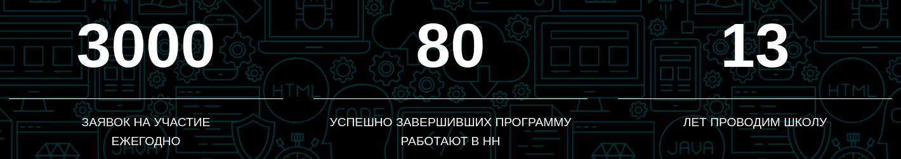

# Отзыв о Школе Программистов HeadHunter (hh.ru). [Draft]

В 2022-2023 году я проходил обучение в [Школе Программистов](https://school.hh.ru/) компании HeadHunter. В данной статье я бы хотел поделиться своими впечатлениями от обучения в Школе.

## Содержание отзыва

...

## Для кого и зачем

Целевая аудитория — в том числе те, кто планирует поступить в Школу.

Цель статьи — рассказать о процессе обучения в Школе, чтобы кандидаты имели больше информации о том, как именно проходит обучение. Возможно эта информация поможет кандидатам принять взвешенное решение о том, стоит ли им поступать в Школу Программистов. Для тех, кто решит поступать и успешно пройдет вступительные испытания, эта информация возможно сделает процесс обучения более прозрачным и комфортным.

## Что стоит знать о компании HeadHunter

### Как HeadHunter собирает и обрабатывает ваши персональные данные

Первое, с чем стоит ознакомиться — [политика обрабоки персональных данных](https://school.hh.ru/personal_data) компании HeadHunter.

...

В общем, основная мысль здесь следующая. У HeadHunter много ваших персональных данных, и очень вероятно, что эти персональные данные включают в себя не только те, которые собираются на сайте hh.ru, мобильным приложением или другими сервисами HeadHunter.

Далее. На лендинге сайта Школы кандидатов просят оставить в том числе свой номер телефона для связи. Зачем? Всю коммуникацию в рамках Школы можно построить и не зная номера. Вполне вероятно, что номер телефона — это ключик к вашим персональным данным. И если это действительно так, то это также и сигнал к тому, что организаторов Школы ваши персональные данные очень даже интересуют. Думаю, их обязятельно посмотрят перед тем, как отправить вам заявку с приглашением или отказом, наверняка будут смотреть, пока вы будете учиться в Школе, и возможно посмотрят ещё некоторое время после.

Может возникнуть мысль: «Ну и что? Ну допустим посмотрят и что из этого? Если у HeadHunter есть какие-то свои критерии, по которым они отбирают кандидатов в Школу, то наверное они откажут, если я под эти критерии не подхожу, это же их дело». Все так. Но ваши персональные данные можно использовать по-разному. Если бы все обстояло именно так, как упомянуто выше, то данная статья едва ли имела место быть. Но обо всем по порядку.

## Что можно узнать о Школе Программистов из открытых источников

В публичных источниках можно найти немало материалов о Школе Программистов. Ниже перечислены некоторые из них. Возможно кому-то будет интересно с ними ознакомиться.

### Охэхэнная «Школа программистов»

[Видео](https://www.youtube.com/watch?v=FXwh6LGYXpE) о том, «как работает Школа Программистов, о том, что это за Школа, как работает набор, кого мы готовим и что получаем в финале». На что, возможно, стоит обратить внимание:

- **Кирилл Васильев** (8.41). Наша цель — к концу учебного цикла подготовить выпускников, которые могли бы у нас работать как разработчики.
- **Александр Дворник** (10.25). А теперь я расскажу о самом интересном. О том, как происходит отбор в команды HeadHunter. За школьниками мы аккуратно наблюдаем уже с самых первых лекций. Смотрим на их посещение и на то, как ребята выполняют домашние задания. Начиная с проектной части у каждой группы школьников есть ментор, и именно он внимательно следит за тем, что ребята делают на проекте, кто какой вклад вносит. Это именно те пункты, на которые стоит обратить внимание, если вы хотите попасть в команды HeadHunter.
- **Макс Сыромятников** (0.27). За 12 лет из выпускников мы наняли 87 разработчиков.

### Школа Программистов на дому

[Школа Программистов на дому (13 октября, 2021)](https://www.youtube.com/watch?v=vxBLek6wrYw&t) — ещё одно видео, из которого можно узнать о том, как работает Школа.

- **Павел Мартышев** (2.10). На мой взгляд самая интересная и полезная часть Школы Программистов — это создание проектов. Несмотря на то, что это учебные проекты, они иногда всё-таки попадают в продакшен, и выпускники сразу могут видеть результаты своей работы.
- **Павел Мартышев** (3.00). В прошлом году, например, вышло 14 человек. За всё время существования Школы 77 выпускников перешло работать в нашу компанию.

### Публичные трансляции финальных демо проектов

В 2021 и в 2022 году проводились публичные трансляции финальных демо проектов Школы Программистов:

- [Финальное демо проектов школы программистов и продактов 2022](https://www.youtube.com/watch?v=-uJgUugVqS4)
- [Финальное онлайн-демо школы программистов и школы продактов](https://www.youtube.com/watch?v=lZASUtpFcWo)

В 2023 году публичного демо не проводилось.

### Школа программистов как решение проблемы найма / Лев Екасов (HeadHunter)

В [данном](https://www.youtube.com/watch?v=-S3_1VCb_1A) видео [бывший](https://www.youtube.com/watch?v=QqYnnUy1zjk) сотрудник компании HeadHunter Лев Екасов рассказывает о том, как организована Школа Программистов.

Обратите внимание на часть доклада, которая начинается с 19.54. Начиная с этого момента Лев Екасов рассказывает о том, что компания HeadHunter организует Школу Программистов в том числе для того, чтобы развивать текущих сотрудников HeadHunter. Как именно могут развиваться сотрудники?

- **Лев Екасов** (21.21). Читать лекции.
- **Лев Екасов** (22.25). Руководить школьным проектом. ... разработчик может не уметь руководить командой или проектом и Школа может ему в этом помочь. Когда я полтора года после Школы проработал разработчиком, в компании открылась позиция тимлида, так как старый тимлид уехал за границу. Образовался внутренний конкурс. ... я пошел куратором одного из проектов внутри Школы, получил опыт управления командой, затем успешно прошел собеседование и стал тимлидом.
- **Лев Екасов** (24.02). Узнавать про новые технологии слушая чужие лекции. ... это реально важно использовать Школу по максимуму. Школа не является только инструментом для найма и, возможно, даже не столько инструментом для найма.

## Статистика набора и найма

Пользуясь данными из различных публичных источников, я собрал статистику набора в Школу Программистов и найма в HeadHunter. Вот что получилось:

| Года | Число заявок | Решили 2 задачи | Собеседование | Поступили | Наняты | Нанято всего
|-|-|-|-|-|-|-|
|2017 - 2018|-|-|-|-|-|40|
|2020 - 2021|3773|283|-|42|14|77|
|2021 - 2022|3400|190|-|50|-|**87**|
|2022 - 2023|2873|270|122|42|-|**80**|
|2023 - 2024|2483|590|122|43|-|-|

Где можно найти все цифры:

- Данные о том, сколько выпускников было нанято за 8 лет существования Школы, можно найти в [видео (9.40)](https://www.youtube.com/watch?v=-S3_1VCb_1A) из секции [Школа программистов как решение проблемы найма / Лев Екасов (HeadHunter)](#школа-программистов-как-решение-проблемы-найма--лев-екасов-headhunter).
- Данные за 2020 год, то есть за 11 лет существования Школы, можно найти в [видео](https://www.youtube.com/watch?v=vxBLek6wrYw&t) из секции [Школа Программистов на дому](#школа-программистов-на-дому).
- Данные о том, сколько всего человек было нанято в HeadHunter за 12 лет существования Школы, можно найти в [видео](https://www.youtube.com/watch?v=FXwh6LGYXpE) из секции [Охэхэнная «Школа программистов»](#охэхэнная-«школа-программистов»).
- Данные за 2022 год (кроме количества нанятых выпускников) можно найти в следующией статье: [Школа Программистов-2022: вступительные испытания и разбор задач](https://habr.com/ru/companies/hh/articles/725648/).
- Данные за 2023 год (кроме количества нанятых выпускников) можно найти в следующей статье: [Разбор задач Школы программистов 2023](https://habr.com/ru/companies/hh/articles/769642/).

Данные о том, сколько выпускников было нанято за 13 лет существования Школы, можно найти на [сайте](https://school.hh.ru/) Школы. На момент написания статьи (конец 2023 года), цифры такие:

Можно заметить, что в этих данных есть противоречие: число выпускников, нанятых за 13 лет существования Школы (80 человек), меньше, чем число выпускников, нанятых за 12 лет существования Школы (87 человек). То есть как минимум одна из этих цифр взята с потолка.

В целом ничего криминального, но выглядит странно. В каждом из упомянутых выше видео о Школе упоминается статистика найма, то есть видно, что эти цифры важны для организаторов. Но тут как-то не складывается. Возможно просто не стоит сходу доверять всем этим цифрам (а может и другим цифрам с hh.ru).

## Как я поступил в Школу Программистов

Примерно в октябре 2022 года я нашел информацию о Школе в футере сайта hh.ru. Подал заявку, решил вступительные испытания, прошел собеседование. По итогам меня пригласили поучаствовать в Школе.

## Теоретическая часть

Общение участников Школы и организаторов проходило в Mattermost. Лекции проводились два раза в неделю, по некоторым лекциям были домашние задания. Все лекции записывались и выкладывались в чате в Mattermost. По каждой лекции участников Школы просили дать обратную связь. Для этого участников просили заполнять небольшой опрос после каждой лекции. Все опросы были анонимные.

Далее тезисно о некоторых преподавателях и лекциях.

* Никита Бездольный. Две лекции. Первая — про систему контроля версий git. Вторая — про GitHub.
* Никита Башаров. Лекция про систему сборки Maven.
* Олег Негрозов. Две лекции по Java. Первая лекция — основы. Система типов, условные конструкции, циклы, методы, классы. Вторая лекция — более продвинутые темы: дженерики, интерфейсы, Stream API. Домашнее задание — реализовать пару методов и оценить сложность их работы в терминах O-нотации.
* Леонид Феськов. Лекция по основам HTML/CSS.
* Борис Сержан. Лекция по тестированию, как организовано тестирование в HeadHunter.
* Реляционные базы данных, PostgreSQL.
* Александр Искусков. Лекция по NoSQL базам данным. Зачем нужны, в чем разница между реляционными базами данных, какие нереляционные базы данных используются в HeadHunter.
* Николай Вознесенский. Две лекции. Первая — потоки (Threads), thread-пулы, потокобезопасные структуры данных (ConcurrentHashMap, BlockingQueue). Вторая — параллельные вычисления с помощью Stream API. CompletableFuture, асинхронные вычисления в Java, виртуальные потоки (Virtual Threads).
* Безопасность веб-приложений. SQL Injections, XSS attacks.
* Артем Филиппов. JDBC, Hibernate.
* Наталья Лукьянчикова. A/B тесты. Каким образом A/B тесты проводятся в компании HeadHunter.
* Николай Грибанов. Архитектура веб-приложений. Паттерны проектирования.
* Евгений Бокшицкий. Kafka, RabbitMQ. Что такое брокеры сообщений и для чего они нужны.
* Алексей Дубинин. JVM. Как работает Java Virtual Machine, различные реализации.
* Кирилл Васильев. Контейнеры сервлетов. Jetty/Jersey. 
* Роман Варламов. Технологии виртуализации и контейнеризации, Docker.
* Андрей Никишин. Фреймворк Spring.
* Алексей Анацкий. Лекция по Python.

В целом хорошо. Лекции, домашние задания, ревью. На что хотелось бы обратить внимание.

1) Преподаватели очень любят хвалить участников Школы. «Отличная работа, ты молодец! Вы все сильные! Вы все молодцы, что дошли до конца лекционной части! Это очень непросто! Я бы наверное также писал!». Не стоит обольщаться. Не стоит быть наивными. Стоит понимать, что организаторы Школы преследуют исключительно прагматичные цели. Я не то чтобы против похвалы, но в случае с HeadHunter стоит быть аккуратными.

2) Оценка домашних заданий. Все домашние задания оцениваются от 0 до 10 баллов. Насколько я помню, оценки всех участников Школы в итоге не сильно отличаются друг от друга (зачем? здоровый дух соревнования). Но стоит понимать, что реальное положение дел иное. Уровень участников Школы может отличаться очень существенно, и баллы этого не отражают. Почему это важно? (более чем уверен, что часть народу набирают просто чтобы потренироваться, и возможно поиспользовать на проектах, но участникам, конечно, об этом не скажут).

## Проектная часть

### Как всё было организовано

Через некоторе время после окончания лекционной части всех участников Школы пригласили на презентацию проектов. После презентации участников попросили выбрать три проекта, в которых они хотели бы участвовать. Затем всех участников поделили на команды.

Всего было семь проектов. В каждом из проектов участвовало три бэкенд разработчика, и один-два фронденд разработчика. У каждого проекта был один или несколько менторов.

Наш проект был посвящен разработке веб-сервиса, позволяющего проверять знания фронденд разработчиков — умение верстать и умение программировать на JavaScript. Автором проекта выступал Алексей Анацкий, ментором был Роман Филлипских — фронтенд разработчик из команды WebServices. Также нам помогал Александр Красовский — бэкенд разрабочик из команды WebServices.

Все проекты хранились в [репозитории](https://github.com/hhru-school) на GitHub, некоторые из проектов (в том числе и наш) были публичные.

### Как прошел проект

Все началось с того, что ментор нашего проекта Роман Филлипских добавил нас в приватный чат в Mattermost. Там мы договорились об онлайн-встрече всей командой.

На первой встрече мы познакомились, обсудили некоторые детали проекта, а также договорились о том, как будем выстраивать дальнейшую коммуникацию. Один из участников проекта предложил всю коммуникацию вести в Telegram. Большая часть участников и Роман согласились, и через некоторое время мы создали чат в Telegram.

Через некоторое время Роман добавил в чат в Mattermost ещё одного разработчика из HeadHunter — Александра Красовского. В чат в Telegram Александр не добавился, так как, по словам Романа, Александру было неудобно общаться в Telegram.

В итоге получилась следующая ситуация: все участники (включая меня) и ментор проекта Роман Филлипских общались в чате в Telegram. Александр Красовский присутствовал только в чате в Mattermost. При этом Александр участвовал в ревью Pull Request-ов бекэнд разрабочиков и, так как он был вне контекста всех обсуждений, которые велись в чате в Telegram, во время процесса ревью возникали проблемы со взаимопониманием.

Через некоторое время мы провели ещё две онлайн-встречи, на которых обсуждали зоны ответственности участников, обязанности, а также идеи, связанные с реализацией проекта. 

В какой-то момент я почуствовал, что коммуникация в команде идет тяжело. Из-за того, что Александр Красовский (бэкенд разработчик команды WebServices) в чате в Telegram не присутствовал и ни на одну из онлайн-встреч не пришел, мне было сложно обсуждать свои идеи, связанные с реализацией бэкенда нашего сервиса. Я решил покинуть проект и вышел из чата в Telegram.

- Коммиты, обсуждения. Организация оставляет желать лучшего.
- Очень сильный контраст с другими проектами. Возникло ощущение, что с самого начала на проект просто забили. К концу проекта кстати из 5ти участников осталось только 2е. Очень явный сигнал к тому, что что-то не так со стороны организаторов. Ясно, что это их дело, как организовывать проекты, но пример очень хорошо демонстрирует, что такая ситуация более чем возможна.

## Итоги

Здесь тезисно подведу итоги.

- Персональные данные. Почему обращаю внимание? Сами рассказали. Намеки, игры с персональными данными (примеры из блогов).
- Цель - подготовить разработчиков. Зачем 40 человек? Потренироваться? Ничего плохого, но учитывая игры с персональными данными и риски возможно стоит задуматься.
- Проекты - как повезет. Непрозрачно.
- Риски. Буллинг, в том числе с использованием ваших персональных данных, давление. Но персональные данные - не единственный инструмент. Пока взаимодействуете. Но могут забраться сами. Как защититься. VPN. Аккуратнее с приложениями, меньше разрешений, отключать микрофон и геолокацию. Использовать WiFi/Мобильный интернет только когда нужно.
- Чем меньше уровень вашей социальной защищенности, тем больше рисков. Я например не работал, пока учился в Школе, думаю это одна из основных причин, по которой мне показали очень многое, в том числе решили сыграть в игру с персональными данными. Если вы студент или только закончили учиться, думаю ваши риски тоже существенны. Если у вас двое детей и жена-инвалид, то вполне вероятно с вами могут поступить подобным образом. Думаю логика понятна, они именно такие.
